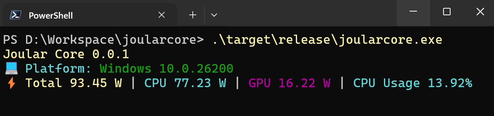
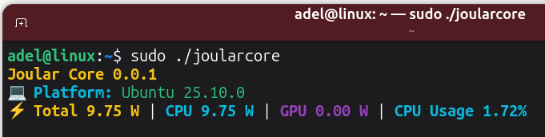
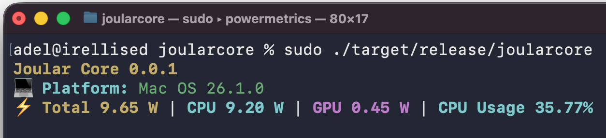
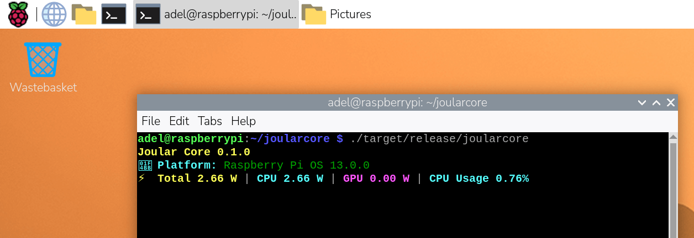
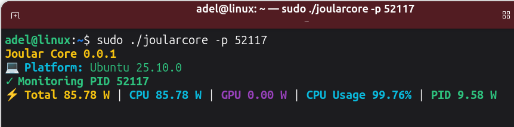
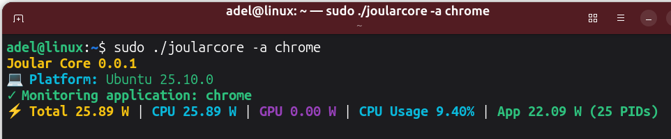
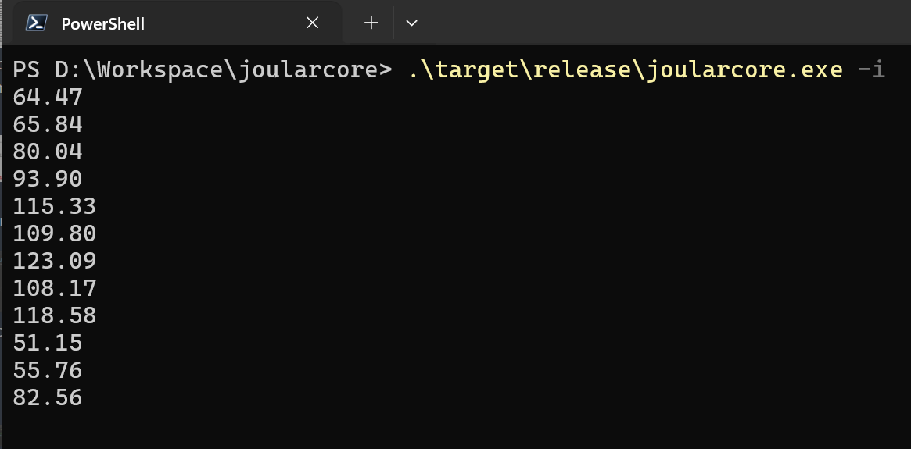
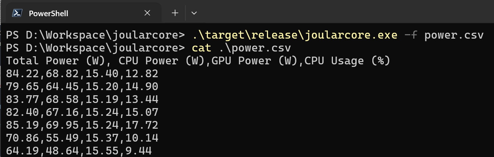

# <a href="https://www.noureddine.org/research/joular/"></a> Joular Core :zap:

[](https://www.gnu.org/licenses/gpl-3.0) 

This is a command line program that uses [Joular Core - Rustic](https://github.com/joular/joularcore-rustic) library to monitor energy on all platforms and operating systems.

---

## Screenshots

#### CLI — Linux, Windows, macOS, Raspberry Pi









#### Process and application monitoring


    


#### Numeric and CSV output modes





---

## CLI Options

Run `joularcore --help` for a complete list. The main options are:

| Option | Description |
|--------|-------------|
| `-p`, `--pid <PID>` | Monitor a specific process by PID |
| `-a`, `--app <APP>` | Monitor an application by name (covers all its processes) |
| `-f`, `--file <FILE>` | Write output to a file. CSV is used by default; with `-i`, the file receives numeric-only values. |
| `-o`, `--overwrite` | With `-f`, truncate before each write so only the latest data row/value is kept |
| `-c`, `--component <cpu\|gpu>` | Show only CPU or only GPU power |
| `-i`, `--numeric` | Output only the numeric value, no formatting or labels |
| `-s`, `--silent` | Suppress terminal output (file and ring buffer still work) |
| `-r`, `--ringbuffer` | Write power data to the shared-memory ring buffer |
| `-v`, `--verbose` | Show the library's log records, such as why a sensor could not be read. Repeat for more detail. |
| `--app-match <exact\|contains>` | How `--app` matches process names (default: `exact`) |
| `--elevation <never\|sudo>` | How far to go for privileged sensor access (default: `never`) |
| `--app-refresh-interval <SECONDS>` | How often to rescan for new PIDs belonging to an application (default: 3s; set to 0 to rescan every second) |
| `--cpu-idle-baseline <WATTS>` | Subtract a fixed idle CPU baseline before attributing power to a PID or application |
| `--calibrate-cpu-idle-baseline` | Measure idle CPU power automatically (5 samples, 1 second each) and use that as the baseline |

**Notes:**
- `--pid` and `--app` are mutually exclusive.
- `--cpu-idle-baseline` and `--calibrate-cpu-idle-baseline` are mutually exclusive.
- `-o` only has effect when used with `-f`.
- When `-f` is used, the live terminal display is replaced by file output.
- `--app-match` defaults to `exact`, which ignores case and a trailing `.exe`. Earlier releases matched substrings on Linux and macOS; pass `--app-match contains` for that behaviour. Exact matching avoids over-matching (`code` would otherwise also match `codesign`), but it excludes helper processes such as `firefox-bin`.
- Power interfaces are privileged on most systems. A sensor that cannot be read shows as `n/a` rather than `0.00`; run with `-v` to see why. On macOS `powermetrics` needs root, so either run the whole CLI under `sudo`, or cache a `sudo` credential and pass `--elevation sudo`. Joular Core never prompts for a password itself.
- The GUI is a separate program, `joularcoregui`.

### Examples

```bash
# Monitor system power
joularcore

# Monitor a specific process
joularcore -p 1234

# Monitor an application by name, write to CSV
joularcore -a firefox -f power.csv

# Include helper processes such as firefox-bin
joularcore -a firefox --app-match contains

# Run silently and write to CSV
joularcore -s -f power.csv

# Only show CPU power, numeric output
joularcore -c cpu -i

# Subtract idle CPU baseline when attributing process power
joularcore -p 1234 --calibrate-cpu-idle-baseline

# On macOS, after caching a sudo credential with `sudo -v`
joularcore --elevation sudo
```

---

## 🔨 Building

The CLI uses the published [`joularcore-rustic`](https://crates.io/crates/joularcore-rustic) library from crates.io, so Cargo fetches it for you:

```bash
git clone https://github.com/joular/joularcore-cli-rustic.git
cd joularcore-cli-rustic && cargo build --release
```

The binary lands at `target/release/joularcore`. Cargo features: `vm` (default) reads power from files written by a hypervisor, and `sbc` builds for single-board computers such as the Raspberry Pi (`--no-default-features --features sbc`).

---

## 🟢 Systemd service on Linux

A ready-to-use systemd unit file is included in the `systemd/` directory. It runs Joular Core CLI as a daemon that continuously overwrites `/tmp/joularcore-service.csv` with the latest power reading. Because overwrite mode truncates before each write, the default service file contains only the latest data row, without a CSV header.

```bash
sudo cp systemd/joularcore.service /etc/systemd/system/
sudo systemctl daemon-reload
sudo systemctl enable joularcore
sudo systemctl start joularcore
```

To use a different output path or add options, edit the `ExecStart` line in the service file before copying it.

---

## 📜 License

Joular Core CLI is licensed under the GNU General Public License 3 license only (GPL-3.0-only).

Copyright © 2025-2026, Adel Noureddine.
All rights reserved. This program and the accompanying materials are made available under the terms of the [GNU General Public License v3.0 (GPL-3.0-only)](https://www.gnu.org/licenses/gpl-3.0.en.html) which accompanies this distribution.

Author: Prof. Adel Noureddine
